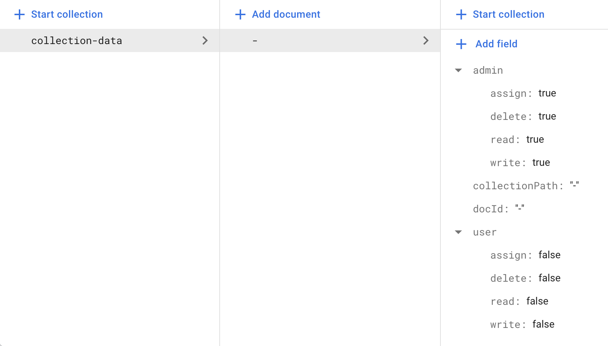
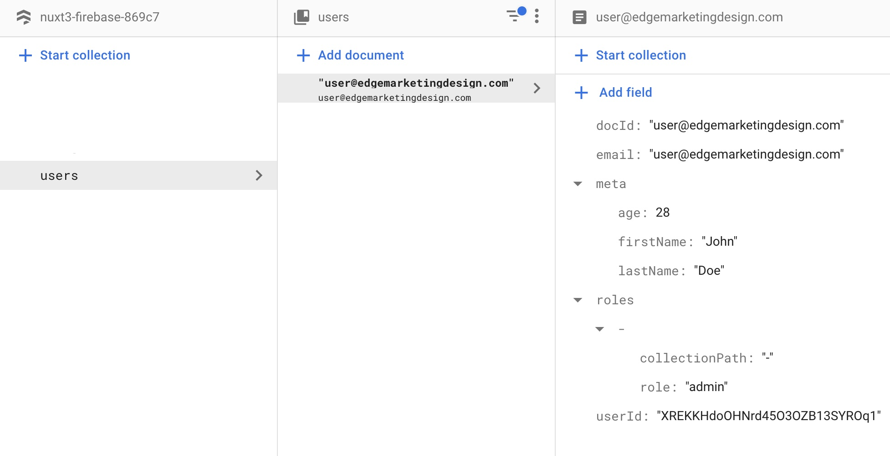

# @edgedev/firebase

A Vue 3 / Nuxt 3 Plugin or Nuxt 3 global composable for firebase authentication and firestore.

### Table of Contents
**[Installation](#installation)**  
**[User Management and Collection Permissions](#user-management-and-collection-permissions)**  
**[Firebase Authentication](#firebase-authentication)**  
**[Firestore Basic Document Interactions](#firestore-Basic-document-interactions)**  
**[Firestore Snapshot Listeners](#firestore-snapshot-listeners)**  
**[Firestore Static Collection Data](#firestore-static-collection-data)** 

# Installation

pnpm install @edgedev/firebase

```bash
pnpm install @edgedev/firebase
```
### Installing with Nuxt 3 global composables

Add a file (whatever.ts) to your "composables" folder with this code:

```typescript
import { EdgeFirebase } from "@edgedev/firebase";
const config = {
    apiKey: "your-apiKey",
    authDomain: "your-authDomain",
    projectId: "your-projectId",
    storageBucket: "your-storageBucket",
    messagingSenderId: "your-messagingSenderId",
    appId: "your-appId"
  };
const edgeFirebase = new EdgeFirebase(config);
export { edgeFirebase };
```

##### *Nuxt must be configured with SSR disabled, update the nuxt.config.ts file (if other parts of your project SSR, see Nuxt 3 plugin instuctions):
```javascript
export default defineNuxtConfig({ ssr: false });
```

### Installing as a plugin

#### Vue 3 plugin, main.js example:
```javascript
import { createApp } from "vue";
import App from "./App.vue";

//edgeFirebase Plugin 
import eFb from "@edgedev/firebase";
app.use(eFb, {
    apiKey: "your-apiKey",
    authDomain: "your-authDomain",
    projectId: "your-projectId",
    storageBucket: "your-storageBucket",
    messagingSenderId: "your-messagingSenderId",
    appId: "your-appId"
  })
//end edgeFirebase

app.mount("#app");
```

#### Nuxt 3 example using the plugins folder:
Add a file (whatever.client.ts) to your "plugins" folder with the following code:

***-Note the ".client" in the file name. If the file doesn't have that in the name you must disabled SSR in the nuxt config.***
```javascript
import eFb from "@edgedev/firebase";
export default defineNuxtPlugin((nuxtApp) => {
  nuxtApp.vueApp.use(eFb, {
    apiKey: "your-apiKey",
    authDomain: "your-authDomain",
    projectId: "your-projectId",
    storageBucket: "your-storageBucket",
    messagingSenderId: "your-messagingSenderId",
    appId: "your-appId"
  });
});
```
***-Alternatively you can disable SSR for your entire Nuxt project instead of naming the plugin with ".client", update the nuxt.config.ts file:***

```javascript
export default defineNuxtConfig({ ssr: false });
```


#### After installing as a plugin you will need to include this in "script setup" in any component you want to use EdgeFirebase in:
```javascript
<script setup>
import { inject } from "vue";
const edgeFirebase = inject("edgeFirebase");
</script>
```

# User Management and Collection Permissions

#### Adding a User

Users must be added before they can register with a login and password.  When adding a user you can pass role and/or special permissions and user meta data.  For more explanations on role and special permssions, see below.

How to add a user:

```javascript
edgeFirebase.setUser({
    email: "user@edgemarketingdesign.com",
    roles: [
      {
        collectionPath: "myItems/subitems/things",
        role: "user"
      }
    ],
    specialPermissions: [
      {
        collectionPath: "otherthings",
        permissions: { assign: false, write: true, read: true, delete: false}
      }
    ],
    meta: { firstName: "John", lastName: "Doe", age: 28 }
});
```


#### Explanation of permissions

- **assign: boolean** - When a user has this permission for a collection they can assign other users to the collection and change permissions for that collection.  When a user has assign they must also have write permissions for that same collection.
- **write: boolean** - Allows a user to write documents to collection
- **read: boolean** - Allows a user to read documents in a collection
- **delete: boolean** - Allows a user to delete documents in a collection 

#### Collection permissions by role

Each collection (including sub collections) will automatically have permissions keyed by role.  By default each collection and sub collection will receive the following permissions by role when created:

- **admin:** assign: true, write: true, read: true, delete: true
- **user:** assign: false, write:false, read: false, delete: false

How to change role permissions for a specific collection:

```javascript
edgeFirebase.storeCollectionPermissions(
    "myItems/subitems/things",  // Collection path
    "user", // must be user or admin
    {
      assign: false,
      write: false,
      read: true,
      delete: false
    }
 );
```

#### User roles for collections

Users are assigned roles based on collection paths.  A role assigned by a collection path that has sub collections will also determine what the user can do on all sub collections or a user can be assigned a role specifically for a sub collection only.  For example if a user is assigned as admin for "myItems/subitems/things" they will only have admin acces to that collection. But if the user is assigned as an admin for "myItems" they will have the admin permissions for "myItems" and all sub collections of "myItems".

How to assign a user a role for a collection:

```javascript
  edgeFirebase.storeUserRoles(
    "user@edgemarketingdesign.com",
    "myItems/subitems/things",
    "admin"
  );
```

How to remove a role from a user for a collection:

```javascript
  edgeFirebase.removeUserRoles(
    "user@edgemarketingdesign.com",
    "myItems/subitems/things"
  );
```

#### Root permissions and first user

You can assign a user access to all collections in the entire project by giving them a role on "-", which is used to define the root collection path.  This would be for someone who is acting like super admin.   If this is your first user, you will need to manually set them up in the Firstore console. Once a root user is added manually you can use this use to add other "root users" or setup other collections and assign roles to them.

|  |  |
| ------------------------------------------------------------ | ------------------------------------ |


DOCUMENT:   storeUserSpecialPermissions

removeUserSpecialPermissions, removeUser

DOCUMENT listUsers (gets Users by Collection) and listCollectionsCanAssign

DOCUMENT registerUser

DOCUMENT -- ALSO DOCUMENT HOW ALL FUNCTIONS CAN AWAIT AND GET PERMISSION ERROR REPSONSES.

# Firebase Authentication

(currently only sign in with email and password is supported)

If "persistence" is true, login will be saved locally, they can close their browser and when they open they will be logged in automatically.  If "persistence" is false login saved only for the session.
```javascript
  edgeFirebase.logIn(
    {
      email: "devs@edgemarketing.com",
      password: "pasword"
    },
    true // : persistence
  );
```

#### User information is contained in:  edgeFirebase.user
The user object is reactive and contains these items:
```typescript
interface UserDataObject {
  uid: string | null;
  email: string;
  loggedIn: boolean;
  logInError: boolean;
  logInErrorMessage: string;
  meta: object;
  roles: role[]; //see role below
  specialPermissions: specialPermission[]; //see specialPermission bleow
}

// sub types of UserDataObject:
interface role {
  collectionPath: "-" | string; // - is root
  role: "admin" | "user";
}

interface specialPermission {
  collectionPath: "-" | string; // - is root
  permissions: permissions; // see permissions below
}

interface permissions {
  assign: boolean;
  read: boolean;
  write: boolean;
  delete: boolean;
}
```
The reactive item **edgeFirebase.user.loggedIn** can be used in code or templates to determine if the user is logged in.

If there is an error logging in, **edgeFirebase.user.logInError** will be true and **edgeFirebase.user.logInErrorMessage** can be used to return that error to the user.

After logging in, **edgeFirebase.logOut** becomes available.  Logging out will also automatically disconnect all FireStore listeners.

Here is a sample component using the login:
```html
<template>
  <div>
    <div v-if="edgeFirebase.user.loggedIn">
      <button @click="edgeFirebase.logOut">Logout</button><br />
      <ShowThings v-if="edgeFirebase.user.loggedIn" />
    </div>
    <div v-else>
      <input v-model="email" style="width: 400px" type="text" /><br />
      <input v-model="password" style="width: 400px" type="text" /><br />
      <button @click="login">Login</button><br />
      <div v-if="edgeFirebase.user.logInError">
        {{ edgeFirebase.user.logInErrorMessage }}
      </div>
    </div>
  </div>
</template>
```

```javascript
<script setup>
const email = ref("");
const password = ref("");
const login = () => {
  edgeFirebase.logIn(
    {
      email: email.value,
      password: password.value
    },
    true
  );
};
</script>
```
# Firestore Basic Document Interactions
### Adding/Update a Document.
Both adding and updating a document use the same function:  **edgeFirebase.storeDoc(collectionPath, object)** for a document to be updated the object must contain the key **docId** and the value must match the ID of a document in the collection being updated *(Note: All documents returned by edgeFirebase functions will already have docId insert in the document objects)*. If the object does not contain docId or the docId doesn't match a document in the collection, new document will be created.

```javascript
<script setup>
const addItem = {title: "Cool Thing"};
edgeFirebase.storeDoc("myItems", addItem);
</script>
```
Note: When a document is written to the collection several other keys are added that can be referenced:  **doc_created_at**(timestamp of doc creation), **last_updated**(timestamp document last written), **uid**(the user id of the user that updated or created the document).

### Getting a single Document.
If you want to query a single document from a collection use: **edgeFirebase.getDocData(collectionPath, docId)**
```javascript
<script setup>
const docId = "DrJRpDXVsEEqZu0UB8NT";
const singleDoc = edgeFirebase.getDocData("myItems", docId);
</script>
```

### Deleting a Document.
To delete a document use: **edgeFirebase.removeDoc(collectionPath, docId)**
```javascript
<script setup>
const docId = "DrJRpDXVsEEqZu0UB8NT";
const singleDoc = edgeFirebase.removeDoc("myItems", docId);
</script>
```

# Firestore Snapshot Listeners
### Starting a snapshot listener on a collection.
To start a snapshot listen on a collection use: **edgeFirebase.startSnapshot(collectionPath)**
```javascript
<script setup>
edgeFirebase.startSnapshot("myItems");
</script>
```
Once you have started a snapshot reactive data for that snapshot will be available with **edgeFirebase.data[collectionPath]**.  Each document in the data object is keyed with the DocumentId from FireStore.
```html
<template>
  <div>
    <div v-for="item in edgeFirebase.data.myItems" :key="item">
      {{ item.title }}
    </div>
  </div>
</template>
```
### Snapshot listeners can also be queried, sorted, and limited.
#### Query and Sort are an array of objects, Limit is a number
(if passing more than one query on different keys, FireStore may make you create indexes)
```typescript
interface FirestoreQuery {
  field: string;
  operator: WhereFilterOp; // '==' | '<' | '<=' | '>' | '>=' | 'array-contains' | 'in' | 'array-contains-any';
  value: unknown;
}

interface FirestoreOrderBy {
  field: string;
  direction: "asc" | "desc";
}
```
##### Example with query, sort and limit:
```javascript
<script setup>
const query = [{field: "title", operator: "==", value="Cool Thing"}];
const sort = [{ field: "title", direction: "asc" }];
const limit = 10;
edgeFirebase.startSnapshot("myItems", query, sort, limit);
</setup>
```
### Stopping a snapshot listener
To stop listening to a collection use: **edgeFirebase.stopSnapshot(collectionPath)**
```javascript
<script setup>
edgeFirebase.stopSnapshot("myItems");
</setup>
```

# Firestore Static Collection Data
To get static data from a collection use the Object: **edgeFirebase.SearchStaticData()**. Static search is done from a class to handle pagination better.
```javascript
const staticSearch = new edgeFirebase.SearchStaticData();
staticSearch.getData("myItems");
```
After initialized like above... Data will be available from **staticSearch.results.data**

### The static data object can also be queried, sorted, limited and paginated.
(if passing more than one query on different keys, FireStore may make you create indexes)
```typescript
interface FirestoreQuery {
  field: string;
  operator: WhereFilterOp; // '==' | '<' | '<=' | '>' | '>=' | 'array-contains' | 'in' | 'array-contains-any';
  value: unknown;
}

interface FirestoreOrderBy {
  field: string;
  direction: "asc" | "desc";
}
```

### Pagination

For pagination purposes there are 2 functions **staticSearch.next()** and **staticSearch.prev()**  
for updating **staticSearch.results.data** the pagination data set.  There are also two helper variables **staticSearch.results.staticIsFirstPage** (set to true if the data is at the first pagination data set) and **staticSearch.results.staticIsLastPage** (set to true if the data is on the last pagination data set).  Note:  Because of the way Firestore pagination works, you don't know you are at your last data set until you try and query for the next. If you are using using **staticSearch.results.staticIsLastPage** to disable a "Next" button for example it won't happen until the "second" click and in that scenario **staticSearch.results.data** will just remain at the last pagination data set, it won't break.

### Example - Template and code with query, sort, limit, and pagination:
```html
<template>
  <div>
    <div v-for="item in staticSearch.results.data" :key="item">
      {{ item.title }}
    </div>
    <div>
      <button
        v-if="!staticSearch.results.staticIsFirstPage"
        @click="staticSearch.prev()"
      >
        Previous
      </button>
      <button
        v-if="!staticSearch.results.staticIsLastPage"
        @click="staticSearch.next()"
      >
        Next
      </button>
    </div>
  </div>
</template>
```
```javascript
<script setup>
const staticSearch = new edgeFirebase.SearchStaticData();

const query = [{field: "title", operator: "==", value="Cool Thing"}];
const sort = [{ field: "title", direction: "asc" }];
const limit = 10;

staticSearch.getData("myItems", query, sort, limit);
</script>
```
## License
[ISC](https://choosealicense.com/licenses/isc/)