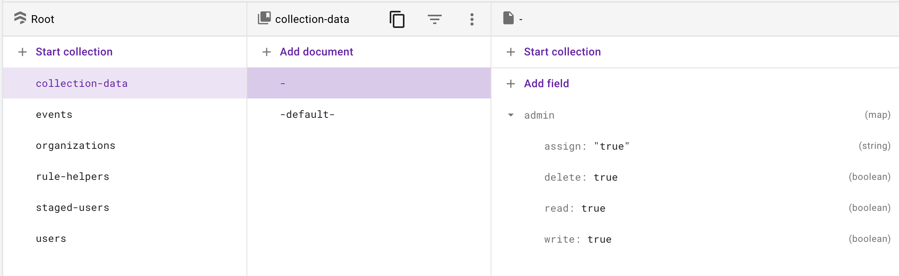

# @edgedev/firebase

A Vue 3 / Nuxt 3 Plugin or Nuxt 3 global composable for firebase authentication and firestore.

### Table of Contents
**[Installation](#installation)**  
**[User Management and Collection Permissions](#user-management-and-collection-permissions)**  
**[Firebase Authentication](#firebase-authentication)**  
**[Firestore Basic Document Interactions](#firestore-Basic-document-interactions)**  
**[Firestore Snapshot Listeners](#firestore-snapshot-listeners)**  
**[Firestore Static Collection Data](#firestore-static-collection-data)**   
**[Await and response](#responses)**  
**[Firestore Rules](#firestore-rules)**

# Installation

pnpm install @edgedev/firebase

```bash
pnpm install @edgedev/firebase
```
### Installing with Nuxt 3 global composables

Add a file (whatever.ts) to your "composables" folder with this code:

```typescript
import { EdgeFirebase } from "@edgedev/firebase";
const config = {
    apiKey: "your-apiKey",
    authDomain: "your-authDomain",
    projectId: "your-projectId",
    storageBucket: "your-storageBucket",
    messagingSenderId: "your-messagingSenderId",
    appId: "your-appId",
    emulatorAuth: "",  // local emlulator port populated app will be started with auth emulator
    emulatorFirestore: "", // local emlulator port populated app will be started with firestore emulator
  };
const isPersistant = true // If "persistence" is true, login will be saved locally, they can close their browser and when they open they will be logged in automatically.  If "persistence" is false login saved only for the session.
const edgeFirebase = new EdgeFirebase(config, isPersistant);
export { edgeFirebase };
```

##### *Nuxt must be configured with SSR disabled, update the nuxt.config.ts file (if other parts of your project SSR, see Nuxt 3 plugin instuctions):
```javascript
export default defineNuxtConfig({ ssr: false });
```

### Installing as a plugin

#### Vue 3 plugin, main.js example:
```javascript
import { createApp } from "vue";
import App from "./App.vue";

//edgeFirebase Plugin 
import eFb from "@edgedev/firebase";
const isPersistant = true // If "persistence" is true, login will be saved locally, they can close their browser and when they open they will be logged in automatically.  If "persistence" is false login saved only for the session.
app.use(eFb, {
    apiKey: "your-apiKey",
    authDomain: "your-authDomain",
    projectId: "your-projectId",
    storageBucket: "your-storageBucket",
    messagingSenderId: "your-messagingSenderId",
    appId: "your-appId",
    emulatorAuth: "",  // local emlulator port populated app will be started with auth emulator
    emulatorFirestore: "", // local emlulator port populated app will be started with firestore emulator
  }, isPersistant)
//end edgeFirebase

app.mount("#app");
```

#### Nuxt 3 example using the plugins folder:
Add a file (whatever.client.ts) to your "plugins" folder with the following code:

***-Note the ".client" in the file name. If the file doesn't have that in the name you must disabled SSR in the nuxt config.***
```javascript
import eFb from "@edgedev/firebase";
const isPersistant = true // If "persistence" is true, login will be saved locally, they can close their browser and when they open they will be logged in automatically.  If "persistence" is false login saved only for the session.
export default defineNuxtPlugin((nuxtApp) => {
  nuxtApp.vueApp.use(eFb, {
    apiKey: "your-apiKey",
    authDomain: "your-authDomain",
    projectId: "your-projectId",
    storageBucket: "your-storageBucket",
    messagingSenderId: "your-messagingSenderId",
    appId: "your-appId",
    emulatorAuth: "",  // local emlulator port populated app will be started with auth emulator
    emulatorFirestore: "", // local emlulator port populated app will be started with firestore emulator
  }, isPersistant);
});
```
***-Alternatively you can disable SSR for your entire Nuxt project instead of naming the plugin with ".client", update the nuxt.config.ts file:***

```javascript
export default defineNuxtConfig({ ssr: false });
```


#### After installing as a plugin you will need to include this in "script setup" in any component you want to use EdgeFirebase in:
```javascript
<script setup>
import { inject } from "vue";
const edgeFirebase = inject("edgeFirebase");
</script>
```

### Firebase Trigger function.

User mangement requires setting up in this firestore trigger function and helper functions  in your firebase functions:

```javascript
const functions = require('firebase-functions')
const admin = require('firebase-admin')
admin.initializeApp()
const db = admin.firestore()

// START @edge/firebase functions
exports.updateUser = functions.firestore.document('staged-users/{docId}').onUpdate((change, context) => {
  const eventId = context.eventId
  const eventRef = db.collection('events').doc(eventId)
  const stagedDocId = context.params.docId
  let newData = change.after.data()
  const oldData = change.before.data()
  return shouldProcess(eventRef).then((process) => {
    if (process) {
      // Note: we can trust on newData.uid because we are checking in rules that it matches the auth.uid
      if (newData.userId) {
        const userRef = db.collection('users').doc(newData.userId)
        setUser(userRef, newData, oldData, stagedDocId).then(() => {
          return markProcessed(eventRef)
        })
      }
      else {
        if (newData.templateUserId !== oldData.templateUserId) {
          newData.isTemplate = false
          const templateUserId = newData.templateUserId
          newData.meta = newData.templateMeta
          delete newData.templateMeta
          delete newData.templateUserId
          if (Object.prototype.hasOwnProperty.call(newData, 'subCreate') && Object.values(newData.subCreate).length > 0) {
            const subCreate = newData.subCreate
            delete newData.subCreate
            db.collection(subCreate.rootPath).add({ [subCreate.dynamicDocumentField]: newData.dynamicDocumentFieldValue }).then((addedDoc) => {
              db.collection(subCreate.rootPath).doc(addedDoc.id).update({ docId: addedDoc.id }).then(() => {
                delete newData.dynamicDocumentFieldValue
                const newRole = { [`${subCreate.rootPath}-${addedDoc.id}`]: { collectionPath: `${subCreate.rootPath}-${addedDoc.id}`, role: subCreate.role } }
                if (Object.prototype.hasOwnProperty.call(newData, 'collectionPaths')) {
                  newData.collectionPaths.push(`${subCreate.rootPath}-${addedDoc.id}`)
                }
                else {
                  newData.collectionPaths = [`${subCreate.rootPath}-${addedDoc.id}`]
                }
                const newRoles = { ...newData.roles, ...newRole }
                newData = { ...newData, roles: newRoles }
                const stagedUserRef = db.collection('staged-users').doc(templateUserId)
                return stagedUserRef.set({ ...newData, userId: templateUserId }).then(() => {
                  const userRef = db.collection('users').doc(templateUserId)
                  setUser(userRef, newData, oldData, templateUserId).then(() => {
                    return markProcessed(eventRef)
                  })
                })
              })
            })
          }
          else {
            const stagedUserRef = db.collection('staged-users').doc(templateUserId)
            return stagedUserRef.set({ ...newData, userId: templateUserId }).then(() => {
              const userRef = db.collection('users').doc(templateUserId)
              setUser(userRef, newData, oldData, templateUserId).then(() => {
                return markProcessed(eventRef)
              })
            })
          }
        }
      }
      return markProcessed(eventRef)
    }
  })
})

function setUser(userRef, newData, oldData, stagedDocId) {
  return userRef.get().then((user) => {
    let userUpdate = { meta: newData.meta, stagedDocId }

    if (Object.prototype.hasOwnProperty.call(newData, 'roles')) {
      userUpdate = { ...userUpdate, roles: newData.roles }
    }
    if (Object.prototype.hasOwnProperty.call(newData, 'specialPermissions')) {
      userUpdate = { ...userUpdate, specialPermissions: newData.specialPermissions }
    }

    if (!oldData.userId) {
      userUpdate = { ...userUpdate, userId: newData.uid }
    }
    console.log(userUpdate)
    if (!user.exists) {
      return userRef.set(userUpdate)
    }
    else {
      return userRef.update(userUpdate)
    }
  })
}

function shouldProcess(eventRef) {
  return eventRef.get().then((eventDoc) => {
    return !eventDoc.exists || !eventDoc.data().processed
  })
}

function markProcessed(eventRef) {
  return eventRef.set({ processed: true }).then(() => {
    return null
  })
}

// END @edge/firebase functions
```

### To make sure your project is secure, install the firestore rules document at the end this documentation. 

# User Management and Collection Permissions

### Adding a User

Users or "Template Users" must be added before someone can register with a login and password (the first user in the project will need to be added manual, see the section below "Root permissions and first user").  When adding a user you can pass role and/or special permissions and user meta data.  For more explanations on role and special permssions, see below. 

Adding a user creates a document for them in the collection "staged-users". The docId of this documment is the used as a registration code and must be passed when using "registerUser" using the "registrationCode" variable.

The collection "staged-users" is a staging zone for all modifications and severs to sanitize the actual users in the "users" collection. Once a user is registered their staged-user is linked to their "users" user.  Genreally speaking the users in the "users" collection should not be modified. In fact, if you adopt the firestore rules shown in this document direct modification of users in the "users" collection is not allowed. All user related functions in this package (editing of meta, setting rules and special permssions, listing of users) are done on the "staged-users" collection. 

To bypass adding users and allow "self registration".  You can add a user that is a "Template User".  By setting the field "template" = true. For a template user  you can also set up dynamic document generation and assigning of the registered user to that document with a specified role, but setting "subCreate".   Then when registering the user you can pass a "dynamicDocumentFieldValue" variable.  In the example below, if on registration you passed: dynamicDocumentFieldValue = "My New Organization", a document would be created under myItems that would look like this: {name:  "My New Organization"}.  The user would also be assigned as an admin to that newly created document.   If your project is going to be completly self registration, you can can create a "Template User" and hard code that registation id into your registation process.

How to add a user:

```javascript
edgeFirebase.addUser({
    roles: [
      {
        collectionPath: "myItems/subitems/things",
        role: "user"
      }
    ],
    specialPermissions: [
      {
        collectionPath: "otherthings",
        permissions: { assign: false, write: true, read: true, delete: false}
      }
    ],
    meta: { firstName: "John", lastName: "Doe", age: 28 } // This is just an example of meta, it can contain any fields and any number of fields.
    template: true,  // Optional - Only true if setting up template for self registation
    subCreate: {
          rootPath: 'myItems',
          role: 'admin',
          dynamicDocumentField: 'name',
          documentStructure: {
            name: '',
          },
        }
});
```

```typescript
interface newUser {
  roles: role[];
  specialPermissions: specialPermission[];
  meta: object;
  isTemplate?: boolean;
  subCreate?: {
    rootPath: string, // This must be a collection path (odd number of segments) since a document will be created and assigned to ther user here.
    role: string, // must be admin, editor, writer, user
    dynamicDocumentField: string, // This is the field in the document that will be set by the value of "dynamicDocumentFieldValue" passed during registration, like "name"
    documentStructure: {
      [key: string]: any
    }
  };
}
```


### Register User

After someoene has been added as a user they will need to "self register" to begin using the system.  Only users that have been added already by someone with assign permissions can register.  The function also checks to make sure they aren't already registered.

```javascript
  edgeFirebase.registerUser({
    email: "user@edgemarketingdesign.com",
    password: "Password1234",
    meta: {
      firstName: "John",
      lastName: "Doe"
    } // This is just an example of meta, it can contain any fields and any number of fields.
    registrationCode: (document id) // This is the document id of either an added user or a template user, when using a template you can simply hardcode the registrationCode of the remplate to allow self registration.
    dynamicDocumentFieldValue: "" // Optional - See explaintion above about self registration and dynamic collectionPath for user roles.
  });
```

```typescript
interface userRegister {
  email: string;
  password: string;
  meta: object;
  registrationCode: string;
  dynamicDocumentFieldValue?: string;
}
```


### Explanation of permissions

- **assign: boolean** - When a user has this permission for a collection they can assign other users to the collection and change permissions for that collection. For a user to be able run setUser, storeCollectionPermisions, storeUserRoles, removeUserRoles, storeUserSpecialPermissions, or removeUserSpecialPermissions, they must have assign access to any of the collection paths passed into those functions.
- **write: boolean** - Allows a user to write documents to collection
- **read: boolean** - Allows a user to read documents in a collection
- **delete: boolean** - Allows a user to delete documents in a collection 

### Collection permissions by role

Roles define what permissions the user willl have.  The system will use collection-data/-default- to lookup the permissions for an assigned role.  The default permissions can be changed or you can define role permissions based on specific collection paths.  If a specific collection path is not found when looking up a user's role permissions

- **admin:** assign: true, write: true, read: true, delete: true
- **editor**: assign: false, write: true, read: true, delete: true
- **writer**: assign: false, write: true, read: true, delete: false
- **user:** assign: false, write:false, read: true, delete: false

How to change role permissions for a specific collection:

```javascript
edgeFirebase.storeCollectionPermissions(
    "myItems/subitems/things",  // Collection path
    "user", // must be admin, editor, writer, user
    {
      assign: false,
      write: false,
      read: true,
      delete: false
    }
 );
```

Deleting collection permissions. This is done to "clean up" whenever a collection path is being deleted.

```javascript
  edgeFirebase.removeCollectionPermissions(
    "myItems/subitems/things")
```


### User roles for collections

Users are assigned roles based on collection paths.  A role assigned by a collection path that has sub collections will also determine what the user can do on all sub collections or a user can be assigned a role specifically for a sub collection only.  For example if a user is assigned as admin for "myItems/subitems/things" they will only have admin acces to that collection. But if the user is assigned as an admin for "myItems" they will have the admin permissions for "myItems" and all sub collections of "myItems".

How to assign a user a role for a collection:

```javascript
  edgeFirebase.storeUserRoles(
    docId,  //Document ID of user in staged-users collection.
    "myItems/subitems/things",
    "admin"
  );
```

Remove a role from a user for a collection:

```javascript
  edgeFirebase.removeUserRoles(
     docId,  //Document ID of user in staged-users collection.
    "myItems/subitems/things"
  );
```

### Root permissions and first user

You can assign a user access to all collections in the entire project by giving them a role on "-", which is used to define the root collection path.  This would be for someone who is acting like a super admin.   If this is your first user, you will need to manually set them up in the Firstore console inside the "staged-users". Once a root user is added manually, you will need to "Register" that user using the docId of the "staged user" as the registration code, please see the user registration section of this documentation. You can use this user to add other "root users" or setup other collections and assign roles to them.  You will also need to manually create the collection-data/-default- role permissions document (mentioned above) and the root permission document, see examples below:





### User special permissions

If you want to give a user a unique set of permissions for a collection that doesn't match the admin or user roles for that collection you can set "special permissions".

```javascript
  edgeFirebase.storeUserSpecialPermissions(
     docId,  //Document ID of user in staged-users collection.
    "myItems/subitems/things",
    {
      assign: false,
      write: true,
      read: true,
      delete: true
    }
  );
```

Remove user special permissions:

```javascript
  edgeFirebase.removeUserSpecialPermissions(
     docId,  //Document ID of user in staged-users collection.
    "myItems/subitems/things"
  );
```


### Remove user

The remove user function doesn't actually delete the user completely from the system but instead removes all roles and special permissions that the user running the function has assign access for.  In this way the user is "removed" as far as the "assigning user" is concerned but the user will remain a user for collections that the "assign user" doesn't have access to.  

```javascript
edgeFirebase.removeUser(docId);
```


### Users Snapshot Data

This will create a reactive object (state.users) that contains the members of the collection passed to the snapshot if the user running the function has assign access for, it will be a listed index by  docId.  

```javascript
edgeFirebase.startUsersSnapshot("myItems");
// Stop users snapshot:
edgeFirebase.stopUsersSnapshot();
```

```vue
<script setup>
 console.log(edgeFirebase.state.users);
</script>
<template>
  <div>
    <div v-for="user in edgeFirebase.state.users" :key="item">
      {{ user.meta.name }}
    </div>
  </div>
</template>
```

```typescript
interface user {
  docId: string;
  roles: role[];
  specialPermissions: specialPermission[];
  userId: string;
  uid: string;
}
```

```typescript
interface role {
  collectionPath: "-" | string; // - is root
  role: "admin" | "editor" | "writer" | "user";
}
```

```typescript
interface specialPermission {
  collectionPath: "-" | string; // - is root
  permissions: permissions;
}
```

```typescript
interface permissions {
  assign: boolean;
  read: boolean;
  write: boolean;
  delete: boolean;
}
```

# Firebase Authentication

(currently only sign in with email and password is supported)

```javascript
  edgeFirebase.logIn(
    {
      email: "devs@edgemarketing.com",
      password: "pasword"
    }
  );
```

#### User information is contained in:  edgeFirebase.user
The user object is reactive and contains these items:
```typescript
interface UserDataObject {
  uid: string | null;
  email: string;
  loggedIn: boolean;
  logInError: boolean;
  logInErrorMessage: string;
  meta: object;
  roles: role[]; //see role below
  specialPermissions: specialPermission[]; //see specialPermission below
}

// sub types of UserDataObject:
interface role {
  collectionPath: "-" | string; // - is root
  role: "admin" | "editor" | "writer" | "user";
}

interface specialPermission {
  collectionPath: "-" | string; // - is root
  permissions: permissions; // see permissions below
}

interface permissions {
  assign: boolean;
  read: boolean;
  write: boolean;
  delete: boolean;
}
```
The reactive item **edgeFirebase.user.loggedIn** can be used in code or templates to determine if the user is logged in.

If there is an error logging in, **edgeFirebase.user.logInError** will be true and **edgeFirebase.user.logInErrorMessage** can be used to return that error to the user.

After logging in, **edgeFirebase.logOut** becomes available.  Logging out will also automatically disconnect all FireStore listeners.

Here is a sample component using the login:
```html
<template>
  <div>
    <div v-if="edgeFirebase.user.loggedIn">
      <button @click="edgeFirebase.logOut">Logout</button><br />
      <ShowThings v-if="edgeFirebase.user.loggedIn" />
    </div>
    <div v-else>
      <input v-model="email" style="width: 400px" type="text" /><br />
      <input v-model="password" style="width: 400px" type="text" /><br />
      <button @click="login">Login</button><br />
      <div v-if="edgeFirebase.user.logInError">
        {{ edgeFirebase.user.logInErrorMessage }}
      </div>
    </div>
  </div>
</template>
```

```javascript
<script setup>
const email = ref("");
const password = ref("");
const login = () => {
  edgeFirebase.logIn(
    {
      email: email.value,
      password: password.value
    },
    true
  );
};
</script>
```
### Change password:

This function allows a user to change their current password while logged in:

```javascript
edgeFirebase.setPassword("old-password", "new-password");
```

### Password Reset:

For users not logged in (like forgotten password).  This is a two step process if the project is setup to redirect password resets back to a custom password reset page.

Step 1:

```javascript
edgeFirebase.sendPasswordReset('user@edgemarketingdesign.com');
```

Step 2: (If the password redirect is setup to go a custom page, you'll need to pull the "oobCode" from the query string and pass that along with the newpassword.)

```javascript
edgeFirebase.passwordReset('NewPassword123','AAaaAABaaaaAAABBBaaaBBBBAaaaaBABAbbaa');
```

### Update User Meta:

A user can update their own meta data when logged in.  The object contain meta data will only update/add the keys passed in the object.

```javascript
edgeFirebase.setUserMeta({ lastName: "Smith" });
```

# Firestore Basic Document Interactions

### Adding/Update a Document.
Both adding and updating a document use the same function:  **edgeFirebase.storeDoc(collectionPath, object)** for a document to be updated the object must contain the key **docId** and the value must match the ID of a document in the collection being updated *(Note: All documents returned by edgeFirebase functions will already have docId insert in the document objects)*. If the object does not contain docId or the docId doesn't match a document in the collection, new document will be created.

```javascript
<script setup>
const addItem = {title: "Cool Thing"};
edgeFirebase.storeDoc("myItems", addItem);
</script>
```
Note: When a document is written to the collection several other keys are added that can be referenced:  **doc_created_at**(timestamp of doc creation), **last_updated**(timestamp document last written), **uid**(the user id of the user that updated or created the document).

### Getting a single Document.
If you want to query a single document from a collection use: **edgeFirebase.getDocData(collectionPath, docId)**
```javascript
<script setup>
const docId = "DrJRpDXVsEEqZu0UB8NT";
const singleDoc = edgeFirebase.getDocData("myItems", docId);
</script>
```

### Deleting a Document.
To delete a document use: **edgeFirebase.removeDoc(collectionPath, docId)**
```javascript
<script setup>
const docId = "DrJRpDXVsEEqZu0UB8NT";
const singleDoc = edgeFirebase.removeDoc("myItems", docId);
</script>
```

# Firestore Snapshot Listeners
### Starting a snapshot listener on a collection.
To start a snapshot listen on a collection use: **edgeFirebase.startSnapshot(collectionPath)**
```javascript
<script setup>
edgeFirebase.startSnapshot("myItems");
</script>
```
Once you have started a snapshot reactive data for that snapshot will be available with **edgeFirebase.data[collectionPath]**.  Each document in the data object is keyed with the DocumentId from FireStore.
```html
<template>
  <div>
    <div v-for="item in edgeFirebase.data.myItems" :key="item">
      {{ item.title }}
    </div>
  </div>
</template>
```
### Snapshot listeners can also be queried, sorted, and limited.
#### Query and Sort are an array of objects, Limit is a number
(if passing more than one query on different keys, FireStore may make you create indexes)
```typescript
interface FirestoreQuery {
  field: string;
  operator: WhereFilterOp; // '==' | '<' | '<=' | '>' | '>=' | 'array-contains' | 'in' | 'array-contains-any';
  value: unknown;
}

interface FirestoreOrderBy {
  field: string;
  direction: "asc" | "desc";
}
```
##### Example with query, sort and limit:
```javascript
<script setup>
const query = [{field: "title", operator: "==", value="Cool Thing"}];
const sort = [{ field: "title", direction: "asc" }];
const limit = 10;
edgeFirebase.startSnapshot("myItems", query, sort, limit);
</setup>
```
### Stopping a snapshot listener
To stop listening to a collection use: **edgeFirebase.stopSnapshot(collectionPath)**
```javascript
<script setup>
edgeFirebase.stopSnapshot("myItems");
</setup>
```

# Firestore Static Collection Data
To get static data from a collection use the Object: **edgeFirebase.SearchStaticData()**. Static search is done from a class to handle pagination better.
```javascript
const staticSearch = new edgeFirebase.SearchStaticData();
staticSearch.getData("myItems");
```
After initialized like above... Data will be available from **staticSearch.results.data**

### The static data object can also be queried, sorted, limited and paginated.
(if passing more than one query on different keys, FireStore may make you create indexes)
```typescript
interface FirestoreQuery {
  field: string;
  operator: WhereFilterOp; // '==' | '<' | '<=' | '>' | '>=' | 'array-contains' | 'in' | 'array-contains-any';
  value: unknown;
}

interface FirestoreOrderBy {
  field: string;
  direction: "asc" | "desc";
}
```

### Pagination

For pagination purposes there are 2 functions **staticSearch.next()** and **staticSearch.prev()**  
for updating **staticSearch.results.data** the pagination data set.  There are also two helper variables **staticSearch.results.staticIsFirstPage** (set to true if the data is at the first pagination data set) and **staticSearch.results.staticIsLastPage** (set to true if the data is on the last pagination data set).  Note:  Because of the way Firestore pagination works, you don't know you are at your last data set until you try and query for the next. If you are using using **staticSearch.results.staticIsLastPage** to disable a "Next" button for example it won't happen until the "second" click and in that scenario **staticSearch.results.data** will just remain at the last pagination data set, it won't break.

### Example - Template and code with query, sort, limit, and pagination:
```html
<template>
  <div>
    <div v-for="item in staticSearch.results.data" :key="item">
      {{ item.title }}
    </div>
    <div>
      <button
        v-if="!staticSearch.results.staticIsFirstPage"
        @click="staticSearch.prev()"
      >
        Previous
      </button>
      <button
        v-if="!staticSearch.results.staticIsLastPage"
        @click="staticSearch.next()"
      >
        Next
      </button>
    </div>
  </div>
</template>
```
```javascript
<script setup>
const staticSearch = new edgeFirebase.SearchStaticData();

const query = [{field: "title", operator: "==", value="Cool Thing"}];
const sort = [{ field: "title", direction: "asc" }];
const limit = 10;

staticSearch.getData("myItems", query, sort, limit);
</script>
```


# Responses

Most functions will return a response that can be used.  

```javascript
const response = edgeFirebase.startSnapshot("things");
const response = await edgeFirebase.storeDoc("myItems", {name: "John Doe"});
```

reponse:

```typescript
interface actionResponse {
  success: boolean;
  message: string;
  meta: {}
}
```

# Firestore Rules

```javascript
rules_version = '2';
service cloud.firestore {

  match /databases/{database}/documents/events/{event} {
    allow read: if false;
    allow create: if false;  
    allow update: if false; 
    allow delete: if false; 
  }
  
  match /databases/{database}/documents/rule-helpers/{helper} {
    allow read: if false;
    allow create: if request.auth.uid == request.resource.data.uid;  
    allow update: if request.auth.uid == request.resource.data.uid;
    allow delete: if false; 
  }

  match /databases/{database}/documents/users/{user} {
      function readSelf() {
        return  resource == null ||
                (
                  "userId" in resource.data && 
                  resource.data.userId == request.auth.uid
                );
      }
    
    allow read: if readSelf();
    allow create: if false;
    allow update: if false;
    allow delete: if false;
  }

  match /databases/{database}/documents/collection-data/{collectionPath} {
    // TODO: these rules need tested.
    function getRolePermission(role, collection, permissionCheck) {
        let pathCollectionPermissions = get(/databases/$(database)/documents/collection-data/$(collection)).data;
        let defaultPermissions = get(/databases/$(database)/documents/collection-data/-default-).data;
        return (role in pathCollectionPermissions && pathCollectionPermissions[role][permissionCheck]) ||
              (role in defaultPermissions && defaultPermissions[role][permissionCheck]);
    }
    function canAssign() {
      let user = get(/databases/$(database)/documents/users/$(request.auth.uid)).data;
      let ruleHelper = get(/databases/$(database)/documents/rule-helpers/$(request.auth.uid)).data['edge-assignment-helper'];
      return collectionPath.matches("^" + ruleHelper[collectionPath].permissionCheckPath + ".*$") &&
      (
        "specialPermissions" in user &&
        ruleHelper[collectionPath].permissionCheckPath in user.specialPermissions &&
        "assign" in user.specialPermissions[ruleHelper[collectionPath].permissionCheckPath] &&
         user.specialPermissions[ruleHelper[collectionPath].permissionCheckPath]["assign"]
      ) ||
      (
        "roles" in user && 
        ruleHelper[collectionPath].permissionCheckPath in user.roles &&
        "role" in user.roles[ruleHelper[collectionPath].permissionCheckPath] &&
         getRolePermission(user.roles[ruleHelper[collectionPath].permissionCheckPath].role, collectionPath, "assign")
      );
    }
    allow read: if request.auth != null; // All signed in users can read collection-data
    allow create: if canAssign();
    allow update: if canAssign();
    allow delete: if canAssign();
  }

  match /databases/{database}/documents/staged-users/{user} {

    function canUpdate() {
      let user = get(/databases/$(database)/documents/users/$(request.auth.uid)).data;
      let ruleHelper = get(/databases/$(database)/documents/rule-helpers/$(request.auth.uid)).data;
      
      return (
              resource == null ||
              request.resource.data.userId == resource.data.userId ||
              (
                resource.data.userId == "" &&
                (
                  request.resource.data.userId == request.auth.uid ||
                  request.resource.data.templateUserId == request.auth.uid
                )
              )
             ) && 
             "edge-assignment-helper" in ruleHelper &&
             permissionUpdatesCheck(user, ruleHelper, "roles") && 
             permissionUpdatesCheck(user, ruleHelper, "specialPermssions") && 
             request.auth.uid == request.resource.data.uid;
    }


    function permissionUpdatesCheck(user, ruleHelper, permissionType) {
      return !(permissionType in request.resource.data) ||
              (
                resource.data.userId == request.auth.uid && 
                request.resource.data[permissionType].keys().hasOnly(resource.data[permissionType].keys())
              ) ||
              (
                resource.data.userId != request.auth.uid &&
                 permissionCheck(permissionType, user, ruleHelper)
              );
    }
    function permissionCheck(permissionType, user, ruleHelper) {
        let lastPathUpdated = ruleHelper["edge-assignment-helper"].fullPath;
        let permissionCheckPath = ruleHelper["edge-assignment-helper"].permissionCheckPath;
        return request.resource.data[permissionType].diff(resource.data[permissionType]).affectedKeys().size() == 0 || 
            (
              request.resource.data[permissionType].diff(resource.data[permissionType]).affectedKeys().size() == 1 && 
              request.resource.data[permissionType].diff(resource.data[permissionType]).affectedKeys() == [lastPathUpdated].toSet() &&
              (
                 permissionCheckPath == "-" || 
                 lastPathUpdated.matches("^" + permissionCheckPath + ".*$")
              ) &&
              (
                (
                  "roles" in user &&
                  getRolePermission(user.roles[permissionCheckPath].role, permissionCheckPath, "assign")
                ) ||
                (
                  "specialPermissions" in user &&
                  permissionCheckPath in user.specialPermissions &&
                  "assign" in user.specialPermissions[permissionCheckPath] &&
                  user.specialPermissions[permissionCheckPath]["assign"]
                )
              )
            );
    }

    function canAssign(user, ruleHelper) {
      return request.auth != null &&
             "edge-assignment-helper" in ruleHelper &&
             (
              (
                "roles" in user &&
                ruleHelper["edge-assignment-helper"].permissionCheckPath in user.roles &&
                getRolePermission(user.roles[ruleHelper["edge-assignment-helper"].permissionCheckPath].role, ruleHelper["edge-assignment-helper"].permissionCheckPath, 'assign')
              ) ||
              (
                "specialPermissions" in user &&
                ruleHelper["edge-assignment-helper"].permissionCheckPath in user.specialPermissions &&
                "assign" in user.specialPermissions[ruleHelper["edge-assignment-helper"].permissionCheckPath] &&
                user.specialPermissions[ruleHelper["edge-assignment-helper"].permissionCheckPath]["assign"]
              )
             )
    }

    function canAssignSubCreatePath(user, ruleHelper) {
      let permissionCheckPath = ruleHelper["edge-assignment-helper"].permissionCheckPath;
      return  (
                !("subCreate" in request.resource.data) ||
                (
                  "subCreate" in request.resource.data &&
                  request.resource.data.subCreate.keys().size() == 0 
                )
              )||
              (
                 permissionCheckPath == "-" || 
                 request.resource.data.subCreate.rootPath.matches("^" + permissionCheckPath + ".*$")
              ) &&
              (
                (
                  "roles" in user &&
                  permissionCheckPath in user.roles &&
                  getRolePermission(user.roles[permissionCheckPath].role, permissionCheckPath, "assign")
                ) ||
                (
                  "specialPermissions" in user &&
                  permissionCheckPath in user.specialPermissions &&
                  "assign" in user.specialPermissions[permissionCheckPath] &&
                  user.specialPermissions[permissionCheckPath]["assign"]
                )
              )

    }

    function canList() {
      let user = get(/databases/$(database)/documents/users/$(request.auth.uid)).data;
      let ruleHelper = get(/databases/$(database)/documents/rule-helpers/$(request.auth.uid)).data;
      return canAssign(user, ruleHelper);
    }

    function canCreate() {
      let user = get(/databases/$(database)/documents/users/$(request.auth.uid)).data;
      let ruleHelper = get(/databases/$(database)/documents/rule-helpers/$(request.auth.uid)).data;
      return noPermissionData() && canAssign(user, ruleHelper) && canAssignSubCreatePath(user, ruleHelper);
    }

    function noPermissionData() {
      return request.resource.data.roles.size() == 0 && request.resource.data.specialPermissions.size() == 0;
    }

    function getRolePermission(role, collection, permissionCheck) {
        let pathCollectionPermissions = get(/databases/$(database)/documents/collection-data/$(collection)).data;
        let defaultPermissions = get(/databases/$(database)/documents/collection-data/-default-).data;
        return (role in pathCollectionPermissions && pathCollectionPermissions[role][permissionCheck]) ||
              (role in defaultPermissions && defaultPermissions[role][permissionCheck]);
      }

     function canGet () {
       return resource == null || 
             ("userId" in resource.data && resource.data.userId == "") || 
             ("userId" in resource.data && resource.data.userId == request.auth.uid) ||
             canAssign(get(/databases/$(database)/documents/users/$(request.auth.uid)).data, get(/databases/$(database)/documents/rule-helpers/$(request.auth.uid)).data);
     }
    allow get: if canGet();
    allow list: if canList();
    allow create: if canCreate();
    allow update: if canUpdate();
    allow delete: if false // TODO if isTemplate is true... can delete... otherwise users never deleted just removed from collection paths
  }

  match /databases/{database}/documents/{seg1} {
      function getRolePermission(role, collection, permissionCheck) {
        let pathCollectionPermissions = get(/databases/$(database)/documents/collection-data/$(collection)).data;
        let defaultPermissions = get(/databases/$(database)/documents/collection-data/-default-).data;
        return (role in pathCollectionPermissions && pathCollectionPermissions[role][permissionCheck]) ||
              (role in defaultPermissions && defaultPermissions[role][permissionCheck]);
      }
      function checkPermission(collectionPath, permissionCheck) {
          let user = get(/databases/$(database)/documents/users/$(request.auth.uid)).data;
          let skipPaths = ["collection-data", "users", "staged-users", "events", "rule-helpers"];
          let ruleHelper = get(/databases/$(database)/documents/rule-helpers/$(request.auth.uid)).data;
          return !(collectionPath in skipPaths) &&
                  request.auth != null &&
                  collectionPath in ruleHelper &&
                  "permissionCheckPath" in ruleHelper[collectionPath] &&
                  (
                    ruleHelper[collectionPath].permissionCheckPath == "-" ||
                    collectionPath.matches("^" + ruleHelper[collectionPath].permissionCheckPath + ".*$")
                  ) &&
                  (
                    (
                      "roles" in user &&
                      ruleHelper[collectionPath].permissionCheckPath in user.roles &&
                      getRolePermission(user.roles[ruleHelper[collectionPath].permissionCheckPath].role, ruleHelper[collectionPath].permissionCheckPath, permissionCheck)
                    ) ||
                    (
                      "specialPermissions" in user &&
                      ruleHelper[collectionPath].permissionCheckPath in user.specialPermissions &&
                      permissionCheck in user.specialPermissions[ruleHelper[collectionPath].permissionCheckPath] &&
                      user.specialPermissions[ruleHelper[collectionPath].permissionCheckPath][permissionCheck]
                    )
                  );
        }
      match /{seg2} {
        allow get: if checkPermission(seg1 + "-" + seg2, "read");
        allow list: if checkPermission(seg1, "read");
        allow create: if checkPermission(seg1, "write");
        allow update: if checkPermission(seg1 + "-" + seg2, "write");
        allow delete: if checkPermission(seg1, "delete");
        match /{seg3} {
          allow get: if checkPermission(seg1 + "-" + seg2 + "-" + seg3, "read");
          allow list: if checkPermission(seg1 + "-" + seg2, "read");
          allow create: if checkPermission(seg1 + "-" + seg2, "write");
          allow update: if checkPermission(seg1 + "-" + seg2 + "-" + seg3, "write");
          allow delete: if checkPermission(seg1 + "-" + seg2, "delete");
          match /{seg4} {
            allow get: if checkPermission(seg1 + "-" + seg2 + "-" + seg3 + "-" + seg4, "read");
            allow list: if checkPermission(seg1 + "-" + seg2 + "-" + seg3, "read");
            allow create: if checkPermission(seg1 + "-" + seg2 + "-" + seg3, "write");
            allow update: if checkPermission(seg1 + "-" + seg2 + "-" + seg3 + "-" + seg4, "write");
            allow delete: if checkPermission(seg1 + "-" + seg2 + "-" + seg3, "delete");

            match /{seg5} {
              allow get: if checkPermission(seg1 + "-" + seg2 + "-" + seg3 + "-" + seg4 + "-" + seg5, "read");
              allow list: if checkPermission(seg1 + "-" + seg2 + "-" + seg3 + "-" + seg4, "read");
              allow create: if checkPermission(seg1 + "-" + seg2 + "-" + seg3 + "-" + seg4, "write");
              allow update: if checkPermission(seg1 + "-" + seg2 + "-" + seg3 + "-" + seg4 + "-" + seg5, "write");
              allow delete: if checkPermission(seg1 + "-" + seg2 + "-" + seg3 + "-" + seg4, "delete");
              match /{seg6} {
                allow get: if checkPermission(seg1 + "-" + seg2 + "-" + seg3 + "-" + seg4 + "-" + seg5 + "-" + seg6, "read");
                allow list: if checkPermission(seg1 + "-" + seg2 + "-" + seg3 + "-" + seg4 + "-" + seg5, "read");
                allow create: if checkPermission(seg1 + "-" + seg2 + "-" + seg3 + "-" + seg4 + "-" + seg5, "write");
                allow update: if checkPermission(seg1 + "-" + seg2 + "-" + seg3 + "-" + seg4 + "-" + seg5 + "-" + seg6, "write");
                allow delete: if checkPermission(seg1 + "-" + seg2 + "-" + seg3 + "-" + seg4 + "-" + seg5, "delete");
                match /{seg7} {
                  allow get: if checkPermission(seg1 + "-" + seg2 + "-" + seg3 + "-" + seg4 + "-" + seg5 + "-" + seg6 + "-" + seg7, "read");
                  allow list: if checkPermission(seg1 + "-" + seg2 + "-" + seg3 + "-" + seg4 + "-" + seg5 + "-" + seg6, "read");
                  allow create: if checkPermission(seg1 + "-" + seg2 + "-" + seg3 + "-" + seg4 + "-" + seg5 + "-" + seg6, "write");
                  allow update: if checkPermission(seg1 + "-" + seg2 + "-" + seg3 + "-" + seg4 + "-" + seg5 + "-" + seg6 + "-" + seg7, "write");
                  allow delete: if checkPermission(seg1 + "-" + seg2 + "-" + seg3 + "-" + seg4 + "-" + seg5 + "-" + seg6, "delete");
                }
              }
            }
          }
        }
      }
    }
  }
```


## License

[ISC](https://choosealicense.com/licenses/isc/)